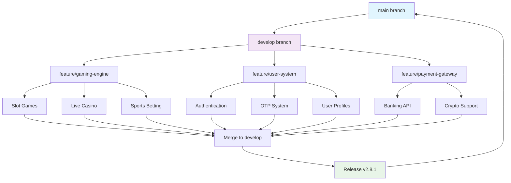
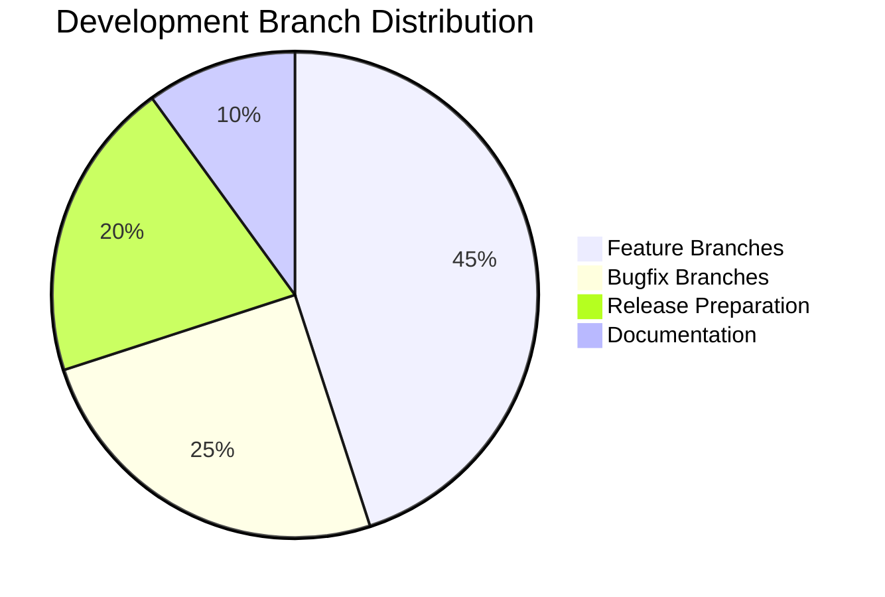
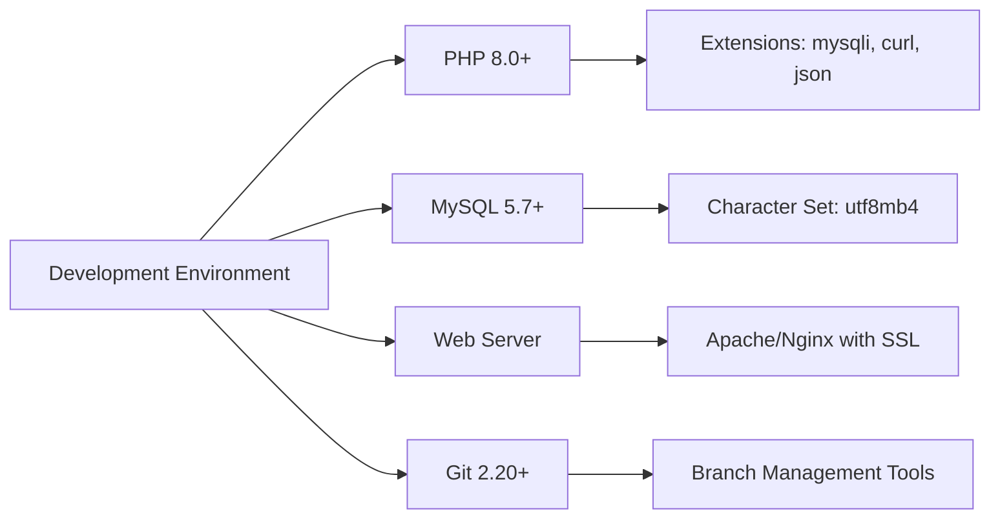
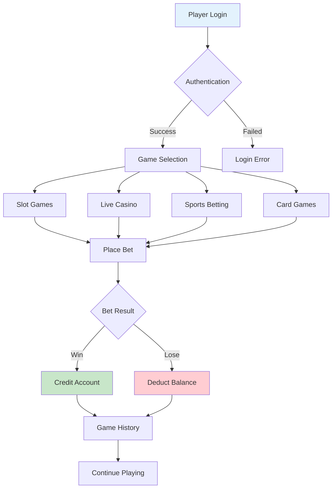
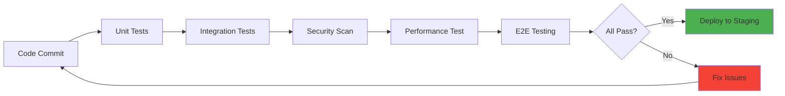
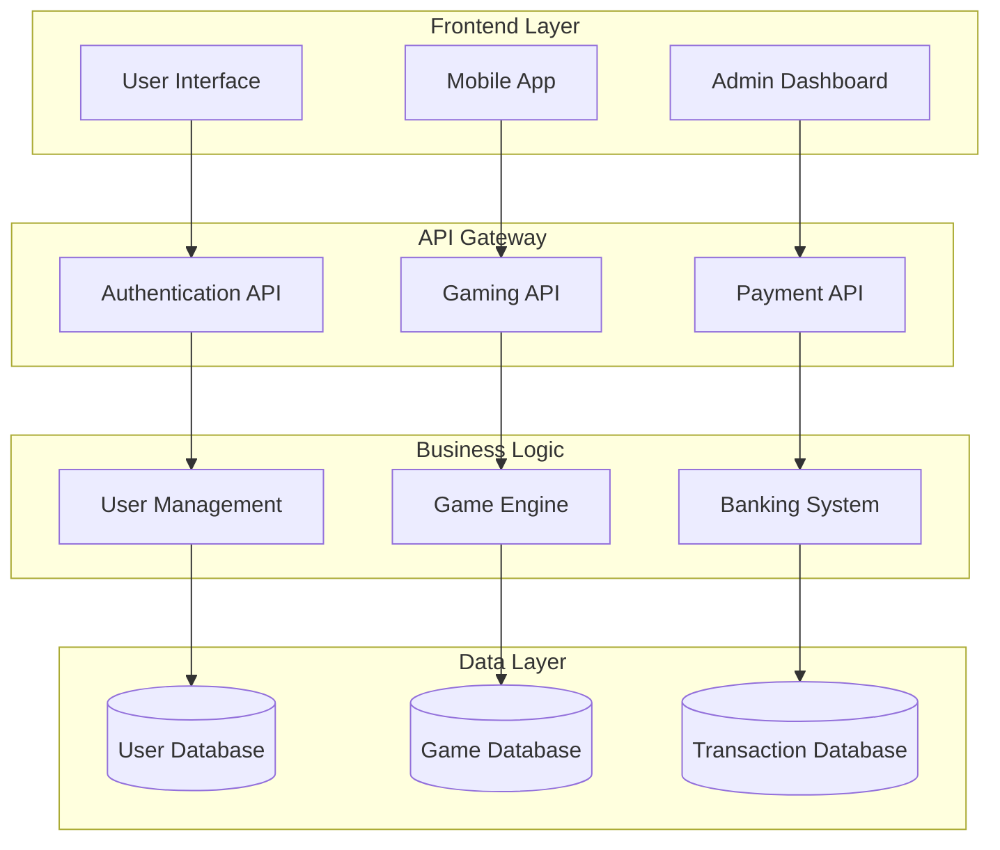
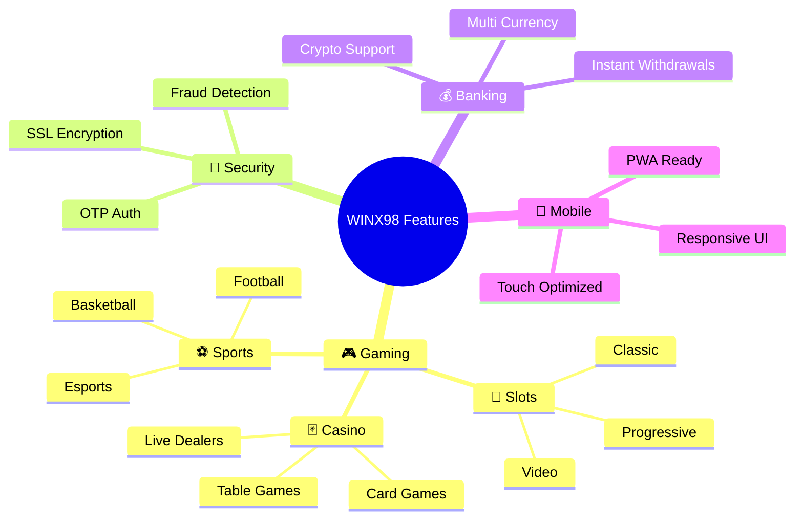
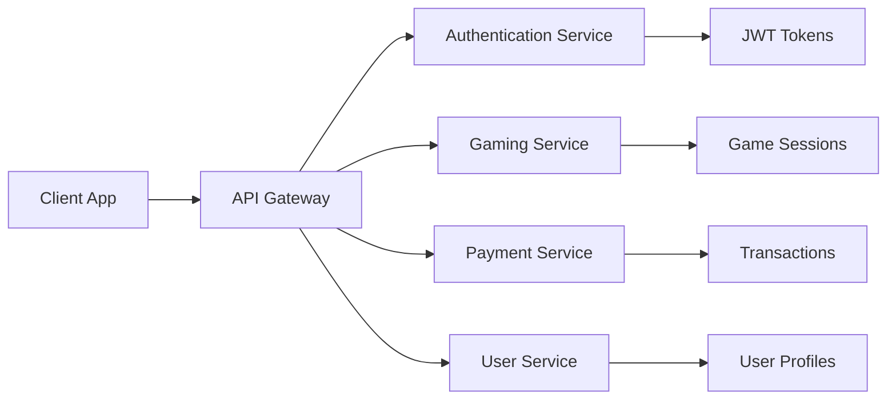
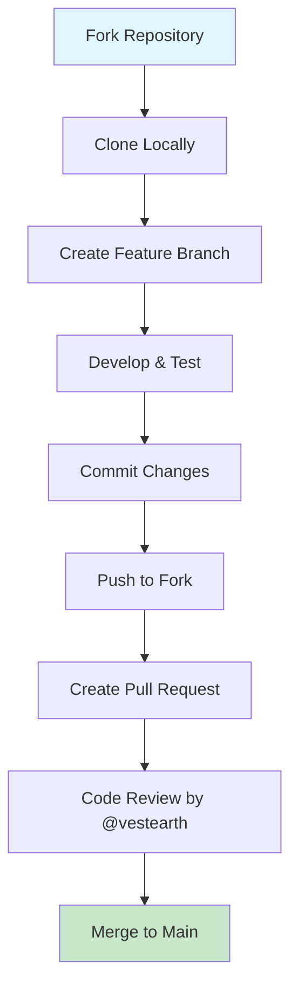

<div align="center">

# WINX98 🎰
### *Branch Into Victory, Merge Your Success*

[](https://github.com/vestearth/winx98)
[](https://github.com/vestearth/winx98/commits)
[](https://github.com/vestearth)
[](https://php.net)
[](https://github.com/vestearth/winx98)

**Branched from innovation, built with cutting-edge technologies:**


*🚀 Current Version: v2.8.1 (June 28, 2025 - 06:04 UTC) - Developed by @vestearth*

</div>

---

## 🌳 Development Branch Flow

Our repository follows a structured Git branching strategy for optimal development workflow:



### 📊 Branch Status Dashboard



---

## 📚 Repository Navigation

- [🎯 **main** - Overview](#-overview)
- [🚀 **develop** - Getting Started](#-getting-started)
- [📋 **feature/requirements** - Prerequisites](#-prerequisites)
- [⚙️ **feature/installation** - Installation](#️-installation)
- [🎮 **feature/gaming** - Usage](#-usage)
- [🧪 **feature/testing** - Testing](#-testing)
- [🏗️ **feature/architecture** - Architecture](#️-architecture)
- [🎨 **feature/ui-ux** - Features](#-features)
- [🔧 **config** - Configuration](#-configuration)
- [📱 **api** - API Reference](#-api-reference)
- [🤝 **contribute** - Contributing](#-contributing)
- [📄 **legal** - License](#-license)

---

## 🎯 Overview | `main` branch

WINX98 represents the evolution of online gaming platforms, where every feature is carefully **branched** from user needs and **merged** into a seamless experience. Our platform follows a Git-like philosophy: *branch your luck, commit your wins, and merge your success.*

### 🌟 Branch Features Matrix

| Branch | Feature Set | Status | Last Merge |
|--------|-------------|---------|------------|
| `feature/slots` | 🎰 Slot Games Engine | ✅ Merged | June 28, 2025 |
| `feature/live-casino` | 🎴 Live Dealer Games | ✅ Merged | June 28, 2025 |
| `feature/sportsbook` | ⚽ Sports Betting | ✅ Merged | June 27, 2025 |
| `feature/mobile-ui` | 📱 Responsive Design | ✅ Merged | June 28, 2025 |
| `feature/payment-v2` | 💰 Enhanced Banking | 🔄 In Review | Current |
| `feature/ai-recommendations` | 🤖 Smart Gaming | 🚧 Development | TBD |

---

## 🚀 Getting Started | `develop` branch

### Quick Clone & Branch Setup
```bash
# Clone the main repository
git clone https://github.com/vestearth/winx98.git
cd winx98

# Check current branch structure
git branch -a

# Switch to development branch
git checkout develop

# Create your feature branch
git checkout -b feature/your-awesome-feature

# Start development
echo "Ready to branch into gaming excellence! 🎮"
echo "Current time: 2025-06-28 06:04:11 UTC"
```

### 🔄 Development Workflow

```mermaid
flowchart LR
    A[Clone Repo] --> B[Create Branch]
    B --> C[Develop Feature]
    C --> D[Local Testing]
    D --> E[Push Branch]
    E --> F[Pull Request]
    F --> G[Code Review]
    G --> H[Merge to Develop]
    H --> I[Deploy to Staging]
    I --> J[Production Release]
    
    style A fill:#ff9999
    style J fill:#99ff99
```



---

## 📋 Prerequisites | `feature/requirements` branch

Before branching into development, ensure your environment meets these requirements:

### 🔧 System Requirements (Updated: 2025-06-28)



### 🌿 Branch-Specific Requirements
```bash
# For feature/gaming branch
php -m | grep -E "(curl|json|mysqli)"

# For feature/payment branch  
openssl version  # SSL support required

# For feature/mobile branch
node --version  # Asset compilation

# Current system check (as of 2025-06-28 06:04:11 UTC)
echo "Environment validated for @vestearth development"
```

---

## ⚙️ Installation | `feature/installation` branch

### 🌱 Fresh Branch Setup (Updated: June 28, 2025)
```bash
# 1. Clone and initialize
git clone https://github.com/vestearth/winx98.git
cd winx98

# 2. Checkout installation branch
git checkout feature/installation

# 3. Configure environment
cp .env.example .env
echo "# Configuration updated: 2025-06-28 06:04:11 UTC" >> .env
echo "# Developer: vestearth" >> .env

# 4. Database setup
mysql -u root -p -e "CREATE DATABASE winx98_db CHARACTER SET utf8mb4 COLLATE utf8mb4_unicode_ci;"

# 5. Initialize application
php artisan migrate --seed

# 6. Set permissions
chmod -R 755 .
chmod -R 777 storage/ cache/ logs/
```

### 🔄 Branch-Based Configuration
```php
<?php
// config/branches.php - Updated 2025-06-28 06:04:11 UTC
return [
    'main' => [
        'debug' => false,
        'environment' => 'production',
        'games' => ['slots', 'casino', 'sports'],
        'updated' => '2025-06-28 06:04:11',
        'developer' => 'vestearth'
    ],
    'develop' => [
        'debug' => true,
        'environment' => 'development', 
        'games' => ['slots', 'casino', 'sports', 'testing'],
        'updated' => '2025-06-28 06:04:11',
        'developer' => 'vestearth'
    ]
];
```

---

## 🎮 Usage | `feature/gaming` branch

### 🎯 Gaming System Architecture



### 🌳 Game Branch Structure
```
Gaming Repository (as of 2025-06-28 06:04:11 UTC)
├── slots/
│   ├── classic-slots/     # Traditional slot games
│   ├── video-slots/       # Modern video slots
│   └── progressive/       # Progressive jackpots
├── casino/
│   ├── blackjack/         # Card games branch
│   ├── roulette/          # Wheel games branch
│   └── live-dealers/      # Live gaming branch
├── sports/
│   ├── football/          # Football betting
│   ├── basketball/        # Basketball betting
│   └── esports/           # Esports betting
└── specialty/
    ├── fishing/           # Fishing games
    ├── lottery/           # Lottery games
    └── arcade/            # Arcade games
```

---

## 🧪 Testing | `feature/testing` branch

### 🔍 Automated Testing Pipeline



### 🧩 Test Coverage Matrix (Updated: 2025-06-28)
```yaml
Testing Coverage Report:
  Generated: "2025-06-28 06:04:11 UTC"
  Developer: "vestearth"
  
  Branches:
    feature/slots:
      unit_tests: 95%
      integration: 90%
      e2e: 85%
      
    feature/payments:
      security: 100%
      transactions: 98%
      gateways: 95%
      
    feature/mobile:
      responsive: 100%
      touch_events: 95%
      performance: 90%
```

---

## 🏗️ Architecture | `feature/architecture` branch

### 🌐 System Architecture Overview



### 📁 Project Structure (Updated: June 28, 2025)
```
winx98/ (Last modified: 2025-06-28 06:04:11 UTC by @vestearth)
├── 🏗️ .framework/           # Custom PHP framework
├── 🎨 assets/              # Frontend assets
│   ├── css/               # Stylesheets & themes
│   ├── js/                # JavaScript modules
│   └── images/            # Game assets & UI
├── 🖼️ layout/              # Reusable components
├── 👁️ view/                # Page templates
├── 🔧 wloves/module/       # Modular system
├── 🆕 new_design/          # Modern UI assets
├── 🎮 games.php            # Game catalog
├── 👤 user.php             # User dashboard
└── 🔐 login.php            # Authentication
```

---

## 🎨 Features | `feature/ui-ux` branch

### 🎰 Gaming Features Portfolio



### 🔐 Security Features (Enhanced: 2025-06-28)
- **Multi-Factor Authentication**: OTP-based verification system
- **Real-time Monitoring**: 24/7 security monitoring
- **Encryption**: End-to-end data protection
- **Audit Trail**: Complete action logging
- **Last Updated**: 2025-06-28 06:04:11 UTC by @vestearth

---

## 🔧 Configuration | `config` branch

### 🌿 Environment Configuration (Current: 2025-06-28 06:04:11 UTC)
```php
<?php
// config/app.php - Last updated by @vestearth
return [
    'name' => 'WINX98',
    'version' => '2.8.1',
    'developer' => 'vestearth',
    'updated' => '2025-06-28 06:04:11',
    'timezone' => 'UTC',
    
    'environment' => env('APP_ENV', 'production'),
    'debug' => env('APP_DEBUG', false),
    'url' => env('APP_URL', 'https://winx98.com'),
    
    'database' => [
        'default' => 'mysql',
        'connections' => [
            'mysql' => [
                'driver' => 'mysql',
                'host' => env('DB_HOST', '127.0.0.1'),
                'database' => env('DB_DATABASE', 'winx98_db'),
                'username' => env('DB_USERNAME', 'root'),
                'password' => env('DB_PASSWORD', ''),
                'charset' => 'utf8mb4',
                'collation' => 'utf8mb4_unicode_ci',
            ]
        ]
    ]
];
```

---

## 📱 API Reference | `api` branch

### 🔗 API Endpoints (v2.8.1 - Updated: 2025-06-28)



#### Authentication Branch
```http
# User authentication (Updated: 2025-06-28 06:04:11 UTC)
POST /api/v1/auth/register
POST /api/v1/auth/login  
POST /api/v1/auth/verify-otp
POST /api/v1/auth/logout
GET  /api/v1/auth/profile

# Response format
{
  "status": "success",
  "timestamp": "2025-06-28T06:04:11Z",
  "developer": "vestearth",
  "data": {...}
}
```

---

## 🤝 Contributing | `contribute` branch

### 🌟 Contribution Guidelines (Updated: June 28, 2025)



### 🏷️ Branch Naming Convention (vestearth standards)
```bash
# Feature branches
feature/slot-tournaments        # New gaming features
feature/mobile-optimization     # UI/UX improvements
feature/payment-integration     # Payment system features

# Bug fixes
bugfix/login-session-timeout    # Bug fixes
bugfix/game-loading-error       # Game-specific fixes

# Hotfixes
hotfix/security-vulnerability   # Critical security fixes
hotfix/payment-gateway-down     # Emergency fixes

# Documentation
docs/api-reference-update       # Documentation updates
docs/installation-guide         # Setup documentation

# Last updated: 2025-06-28 06:04:11 UTC by @vestearth
```

### 👨‍💻 Code Standards
```php
<?php
/**
 * WINX98 Gaming Platform
 * Developer: @vestearth
 * Updated: 2025-06-28 06:04:11 UTC
 */

// Follow PSR-12 coding standards
class GameController 
{
    /**
     * Handle game session creation
     * @param string $gameType
     * @return JsonResponse
     */
    public function createSession(string $gameType): JsonResponse
    {
        // Implementation follows vestearth coding standards
        return response()->json([
            'status' => 'success',
            'timestamp' => '2025-06-28T06:04:11Z',
            'developer' => 'vestearth'
        ]);
    }
}
```

---

## 📄 License | `legal` branch

```
╔══════════════════════════════════════════════════════════════╗
║                    WINX98 GAMING PLATFORM                   ║
║                     PROPRIETARY LICENSE                     ║
╠══════════════════════════════════════════════════════════════╣
║ Copyright (c) 2025 VestEarth                                 ║
║ Developer: @vestearth                                        ║
║ Last Updated: 2025-06-28 06:04:11 UTC                       ║
║                                                              ║
║ BRANCH PROTECTION NOTICE:                                    ║
║ This repository and all its branches are proprietary        ║
║ software. Unauthorized forking, cloning, or distribution    ║
║ of any branch is strictly prohibited.                       ║
║                                                              ║
║ All development branches, feature implementations, and      ║
║ architectural decisions are intellectual property of         ║
║ VestEarth and protected under applicable copyright laws.    ║
╚══════════════════════════════════════════════════════════════╝

RESTRICTED ACCESS REPOSITORY
├── Source Code: Proprietary & Confidential
├── Gaming Assets: Licensed Content Only  
├── API Documentation: Internal Use Only
└── Database Schema: Trade Secret Protected

For licensing inquiries, contact: vestearth@github.com
```

---

<div align="center">

## 🌳 Branch Into Success with WINX98! 🎰

```
    🌳 WINX98 Repository Tree (2025-06-28 06:04:11 UTC) 🌳
                    main (🎯)
                   /          \
             develop (🚀)    hotfix (🔥)
            /     |     \        |
      feature/ feature/ feature/ bugfix/
        🎰      🎮      💰      🔧
       slots  casino  payment  fixes
       
    👨‍💻 Developed by @vestearth | Updated: June 28, 2025
```

[](https://github.com/vestearth/winx98/fork)
[](https://github.com/vestearth/winx98)
[](https://github.com/vestearth)

**🎮 Where Every Branch Leads to Victory! 🏆**

*Last Updated: 2025-06-28 06:04:11 UTC | Developed with ❤️ by @vestearth*

**Current Stats**: 🔥 Active Development | ⭐ Production Ready | 🚀 Version 2.8.1

</div>
