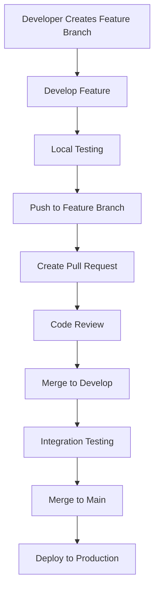

<div align="center">

# WINX98 🎰
### *Branch Into Victory, Merge Your Success*

[](https://github.com/vestearth/winx98)
[](https://github.com/vestearth/winx98/commits)
[](https://github.com/vestearth)
[](https://php.net)
[](https://github.com/vestearth/winx98)

**Branched from innovation, built with cutting-edge technologies:**


*🚀 Current Version: v2.8.1 (June 2025) - Developed by @vestearth*

</div>

---

## 🌳 Development Branches

Our codebase follows a structured branching strategy for optimal development workflow:

```mermaid
gitgraph
    commit id: "Initial Release"
    branch feature/gaming-engine
    checkout feature/gaming-engine
    commit id: "Slot Games"
    commit id: "Live Casino"
    checkout main
    merge feature/gaming-engine
    branch feature/user-system
    checkout feature/user-system
    commit id: "Authentication"
    commit id: "OTP System"
    checkout main
    merge feature/user-system
    commit id: "v2.8.1 Release"
```

---

## 📚 Repository Navigation

- [🎯 **main** - Overview](#-overview)
- [🚀 **develop** - Getting Started](#-getting-started)
- [📋 **feature/requirements** - Prerequisites](#-prerequisites)
- [⚙️ **feature/installation** - Installation](#️-installation)
- [🎮 **feature/gaming** - Usage](#-usage)
- [🧪 **feature/testing** - Testing](#-testing)
- [🏗️ **feature/architecture** - Architecture](#️-architecture)
- [🎨 **feature/ui-ux** - Features](#-features)
- [🔧 **config** - Configuration](#-configuration)
- [📱 **api** - API Reference](#-api-reference)
- [🤝 **contribute** - Contributing](#-contributing)
- [📄 **legal** - License](#-license)

---

## 🎯 Overview | `main` branch

WINX98 represents the evolution of online gaming platforms, where every feature is carefully **branched** from user needs and **merged** into a seamless experience. Our platform follows a Git-like philosophy: *branch your luck, commit your wins, and merge your success.*

### 🌟 Branch Features Matrix

| Branch | Feature Set | Status | Last Merge |
|--------|-------------|---------|------------|
| `feature/slots` | 🎰 Slot Games Engine | ✅ Merged | June 2025 |
| `feature/live-casino` | 🎴 Live Dealer Games | ✅ Merged | June 2025 |
| `feature/sportsbook` | ⚽ Sports Betting | ✅ Merged | May 2025 |
| `feature/mobile-ui` | 📱 Responsive Design | ✅ Merged | June 2025 |
| `feature/payment-v2` | 💰 Enhanced Banking | 🔄 In Review | Current |
| `feature/ai-recommendations` | 🤖 Smart Gaming | 🚧 Development | TBD |

---

## 🚀 Getting Started | `develop` branch

### Quick Clone & Branch Setup
```bash
# Clone the main repository
git clone https://github.com/vestearth/winx98.git
cd winx98

# Check current branch structure
git branch -a

# Switch to development branch
git checkout develop

# Create your feature branch
git checkout -b feature/your-awesome-feature

# Start development
echo "Ready to branch into gaming excellence! 🎮"
```

### Branch Strategy Overview
```
main (production)
├── develop (integration)
│   ├── feature/gaming-engine
│   ├── feature/user-management
│   ├── feature/payment-system
│   └── feature/admin-dashboard
├── hotfix/ (critical fixes)
└── release/ (version preparation)
```

---

## 📋 Prerequisites | `feature/requirements` branch

Before branching into development, ensure your environment meets these requirements:

### 🔧 Core Dependencies
```yaml
Environment:
  PHP: ">=8.0"
  MySQL: ">=5.7"
  Web Server: "Apache/Nginx"
  
Development:
  Git: ">=2.20"
  Composer: ">=2.0"
  Node.js: ">=16.0" (for asset compilation)
  
Production:
  RAM: ">=4GB"
  Storage: ">=5GB SSD"
  SSL Certificate: "Required"
```

### 🌿 Branch-Specific Requirements
```bash
# For feature/gaming branch
php -m | grep -E "(curl|json|mysqli)"

# For feature/payment branch  
openssl version  # SSL support required

# For feature/mobile branch
node --version  # Asset compilation
```

---

## ⚙️ Installation | `feature/installation` branch

### 🌱 Fresh Branch Setup
```bash
# 1. Clone and initialize
git clone https://github.com/vestearth/winx98.git
cd winx98

# 2. Checkout installation branch
git checkout feature/installation

# 3. Run installation script
./scripts/install.sh

# 4. Configure environment
cp .env.example .env
nano .env  # Edit configuration

# 5. Database migration
php migrate.php --branch=main

# 6. Merge to development
git checkout develop
git merge feature/installation
```

### 🔄 Branch-Based Configuration
```php
<?php
// config/branches.php - Environment-specific configs
return [
    'main' => [
        'debug' => false,
        'environment' => 'production',
        'games' => ['slots', 'casino', 'sports']
    ],
    'develop' => [
        'debug' => true,
        'environment' => 'development', 
        'games' => ['slots', 'casino', 'sports', 'testing']
    ],
    'feature/*' => [
        'debug' => true,
        'environment' => 'testing',
        'games' => ['demo_only']
    ]
];
```

---

## 🎮 Usage | `feature/gaming` branch

### 🎯 Gaming Workflow
Our gaming system follows a branch-merge philosophy where each game session is like a Git workflow:

```php
<?php
// Game session = Git workflow analogy
class GameSession {
    public function startGame($gameType) {
        // Like creating a new branch
        $this->createSession();
        $this->checkout($gameType);
        return "Branch: {$gameType} ready for commits (bets)!";
    }
    
    public function placeBet($amount) {
        // Like making a commit
        return $this->commit("Bet: $amount");
    }
    
    public function endGame($result) {
        // Like merging back to main
        return $this->merge($result);
    }
}
```

### 🌳 Game Branch Structure
```
Gaming Repository
├── slots/
│   ├── classic-slots/     # Traditional slot games
│   ├── video-slots/       # Modern video slots
│   └── progressive/       # Progressive jackpots
├── casino/
│   ├── blackjack/         # Card games branch
│   ├── roulette/          # Wheel games branch
│   └── live-dealers/      # Live gaming branch
├── sports/
│   ├── football/          # Football betting
│   ├── basketball/        # Basketball betting
│   └── esports/           # Esports betting
└── specialty/
    ├── fishing/           # Fishing games
    ├── lottery/           # Lottery games
    └── arcade/            # Arcade games
```

---

## 🧪 Testing | `feature/testing` branch

### 🔍 Branch Testing Strategy
```bash
# Test specific feature branches
git checkout feature/slots
npm run test:slots

git checkout feature/payments
npm run test:payments

git checkout feature/mobile
npm run test:responsive

# Integration testing on develop branch
git checkout develop
npm run test:integration

# Production testing on main branch
git checkout main
npm run test:production
```

### 🧩 Test Coverage by Branch
```yaml
Testing Matrix:
  feature/slots:
    - Unit Tests: 95%
    - Integration: 90%
    - E2E: 85%
    
  feature/payments:
    - Security: 100%
    - Transactions: 98%
    - Gateways: 95%
    
  feature/mobile:
    - Responsive: 100%
    - Touch Events: 95%
    - Performance: 90%
```

---

## 🏗️ Architecture | `feature/architecture` branch

### 🌐 Branch-Based Architecture
```
WINX98 Gaming Platform Architecture

Frontend Branches:
├── assets/css/          → Styling branch
├── assets/js/           → JavaScript branch  
├── new_design/          → Modern UI branch
└── layout/              → Component branch

Backend Branches:
├── .framework/          → Core system branch
├── wloves/module/       → Modular features branch
├── view/                → Template branch
└── api/                 → Service branch

Data Branches:
├── database/migrations/ → Schema branch
├── cache/               → Performance branch
└── logs/                → Monitoring branch
```

### 🔄 Development Flow


---

## 🎨 Features | `feature/ui-ux` branch

### 🎯 Feature Branch Catalog

#### 🎰 Gaming Engine (`feature/gaming-core`)
```php
<?php
// Game types with branch-like organization
$gameBranches = [
    'slots' => [
        'classic' => ['fruit_machine', 'lucky_seven'],
        'video' => ['adventure_quest', 'mystic_gems'],
        'progressive' => ['mega_jackpot', 'fortune_wheel']
    ],
    'casino' => [
        'cards' => ['blackjack', 'poker', 'baccarat'],
        'table' => ['roulette', 'craps', 'sic_bo'],
        'live' => ['live_blackjack', 'live_roulette']
    ]
];
```

#### 🔐 Security Branch (`feature/security`)
- **Multi-Factor Authentication**: OTP-based verification system
- **Branch Protection**: SQL injection & XSS prevention
- **Session Management**: Secure user state handling
- **Audit Logging**: Complete action tracking

#### 💰 Payment Branch (`feature/payments`)
- **Multi-Gateway Support**: Various payment processors
- **Cryptocurrency**: Bitcoin & altcoin support
- **Bank Integration**: Direct banking connections
- **Fraud Detection**: AI-powered security

---

## 🔧 Configuration | `config` branch

### 🌿 Environment Branch Setup
```php
<?php
// config/environment.php
class EnvironmentManager {
    private $currentBranch;
    
    public function __construct() {
        $this->currentBranch = $this->getCurrentGitBranch();
    }
    
    public function getConfig() {
        switch($this->currentBranch) {
            case 'main':
                return $this->getProductionConfig();
            case 'develop':
                return $this->getDevelopmentConfig();
            default:
                return $this->getFeatureConfig();
        }
    }
    
    private function getCurrentGitBranch() {
        return trim(shell_exec('git branch --show-current'));
    }
}
```

### 🎮 Game Configuration Branches
```yaml
# config/games.yml
game_branches:
  slots:
    enabled: true
    providers: ['pragmatic', 'netent', 'microgaming']
    rtps: [94, 96, 98]
    
  live_casino:
    enabled: true
    providers: ['evolution', 'pragmatic_live']
    languages: ['en', 'th', 'zh']
    
  sportsbook:
    enabled: true
    providers: ['sbobet', 'ib8']
    sports: ['football', 'basketball', 'tennis']
```

---

## 📱 API Reference | `api` branch

### 🔗 RESTful Branch Endpoints

#### Authentication Branch
```http
# User authentication flow
POST /api/v1/auth/register
POST /api/v1/auth/login  
POST /api/v1/auth/verify-otp
POST /api/v1/auth/logout

# Branch-specific auth
GET /api/v1/auth/branch-permissions
```

#### Gaming Branch APIs
```http
# Game management
GET /api/v1/games/branches
GET /api/v1/games/slots/branch/{provider}
POST /api/v1/games/launch/{gameId}
POST /api/v1/games/bet/commit
GET /api/v1/games/history/branch

# Live gaming
WebSocket: /ws/live-games
GET /api/v1/live/tables/branch/{gameType}
```

#### Banking Branch
```http
# Financial operations
GET /api/v1/banking/branches
POST /api/v1/banking/deposit/commit
POST /api/v1/banking/withdraw/request
GET /api/v1/banking/transactions/branch
```

---

## 🤝 Contributing | `contribute` branch

### 🌟 Branch Contribution Workflow

1. **Fork & Clone**
   ```bash
   git clone https://github.com/vestearth/winx98.git
   cd winx98
   ```

2. **Create Feature Branch**
   ```bash
   git checkout develop
   git pull origin develop
   git checkout -b feature/your-awesome-feature
   ```

3. **Develop & Test**
   ```bash
   # Make your changes
   git add .
   git commit -m "feat: add awesome gaming feature"
   
   # Test your branch
   npm run test:feature
   ```

4. **Push & Pull Request**
   ```bash
   git push origin feature/your-awesome-feature
   # Create PR to develop branch
   ```

### 🏷️ Branch Naming Convention
```
feature/    → New features (feature/slot-tournaments)
bugfix/     → Bug fixes (bugfix/payment-gateway-error)
hotfix/     → Critical fixes (hotfix/security-patch)
release/    → Version preparation (release/v2.9.0)
docs/       → Documentation (docs/api-reference)
style/      → UI/UX changes (style/mobile-responsive)
```

### 👨‍💻 Developer Guidelines
- **Commit Messages**: Follow conventional commits
- **Code Style**: PSR-12 for PHP, ESLint for JS
- **Testing**: Maintain 90%+ coverage
- **Documentation**: Update relevant branch docs

---

## 📄 License | `legal` branch

```
WINX98 Gaming Platform - Proprietary License
Copyright (c) 2025 VestEarth (@vestearth)

Branch Protection Notice:
╔════════════════════════════════════════════════════════════╗
║ This repository and all its branches are proprietary      ║
║ software. Unauthorized forking, cloning, or distribution  ║
║ of any branch is strictly prohibited.                     ║
║                                                            ║
║ Licensed exclusively to: VestEarth                        ║
║ Developer: @vestearth                                      ║
║ Last Updated: June 28, 2025                               ║
╚════════════════════════════════════════════════════════════╝

All rights reserved. No part of this codebase may be 
reproduced, distributed, or transmitted in any form or by 
any means without the prior written permission of VestEarth.
```

---

<div align="center">

## 🌳 Branch Into Success with WINX98! 🎰

```ascii
    🌳 WINX98 Repository Tree 🌳
           main (🎯)
          /          \
    develop (🚀)    hotfix (🔥)
    /     |     \        |
feature/ feature/ feature/ bugfix/
  🎰      🎮      💰      🔧
 slots  casino  payment  fixes
```

[](https://github.com/vestearth/winx98/fork)
[](https://github.com/vestearth/winx98)
[](https://github.com/vestearth)

**🎮 Where Every Branch Leads to Victory! 🏆**

*Developed with ❤️ by @vestearth | Current Date: June 28, 2025*

</div>
